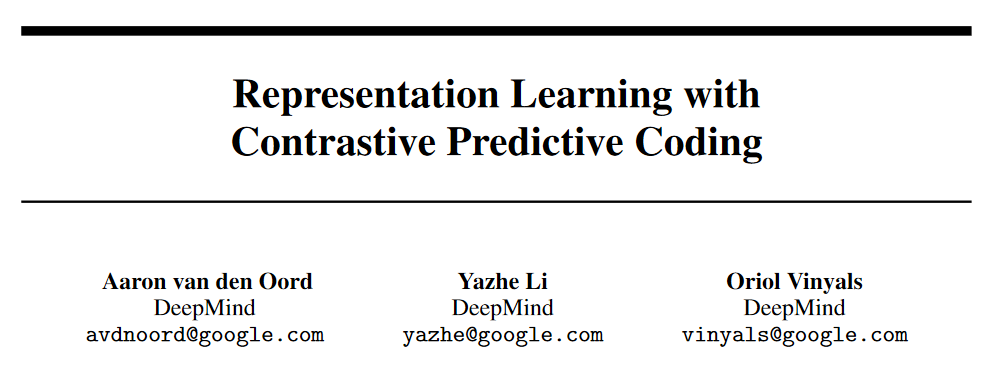
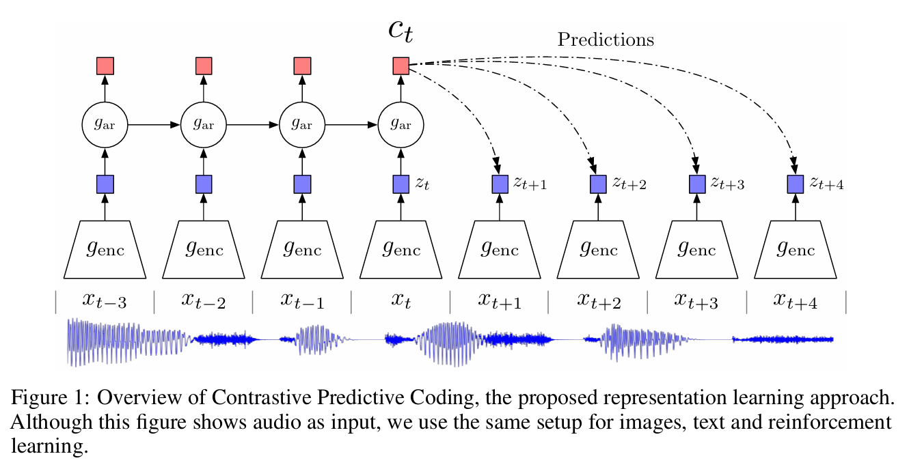
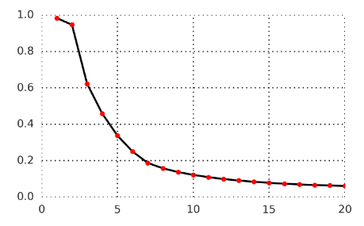
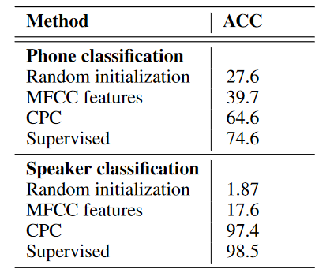
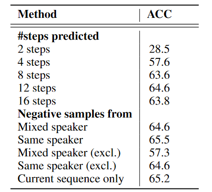
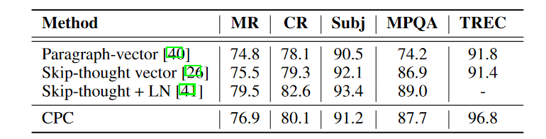

机器学习领域，尤其是**无监督学习和表示学习**中，对比学习（Contrastive Learning）已经成为一种非常流行的方法。**通过最大化与正样本的相似性，同时最小化与负样本的相似性**，使得训练模型能区分“相关”和“不相关”的数据对，从而捕获数据的深层语义信息。

其中，InfoNCE Loss 是一种广泛使用的损失函数。
InfoNCE loss ：
$$\mathcal{L}_N = -\mathbb{E}_X \left[ \log \frac{f_k(x_i, c_t)}{\sum_{x_j \in X} f_k(x_j, c_t)} \right] \tag{4}$$

InfoNCE 全称是 Info Noise-Contrastive Estimation Loss，基于噪声对比估计（Noise-Contrastive Estimation, NCE）。

在InfoNCE Loss的背后，
首次提出：CPC[Contrastive Predictive Coding]
[[1807.03748] Representation Learning with Contrastive Predictive Coding](https://arxiv.org/abs/1807.03748)
应用：对比学习，大模型训练如 CLIP[Contrastive Language-Image Pretraining]所采用。 
[[2103.00020] Learning Transferable Visual Models From Natural Language Supervision](https://arxiv.org/abs/2103.00020)

## 1. CPC

CPC简介:来着google DeepMind 2019
[CPC-Representation Learning with Contrastive Predictive Coding]：基于对比预测编码的表示学习
PPT：[Representation Learning with Contrastive Predictive Coding](https://www2.cs.arizona.edu/~pachecoj/courses/csc696h_spring24/lectures/thang_cpc.pdf)

1. CPC是一个unsupervised representation learning 方法。比起有监督学习，更能学到不针对单个有监督任务特化的特征（即表示，representation）
2. 它可以用于序列数据(文本、语音信号等)，也可以用于图片和强化学习

在无监督的情况下，如何定义训练目标（定义表示的好坏）？
最常见的思路是预测编码（predictive coding），即学到的表示要能够用来 预测未来（future） 或 预测缺失词（missing） 或 预测上下文（context）。比如词嵌入模型Word2Vec中的CBOW和Skip-gram，分别对应后两个预测目标。

CPC 假设预测编码方法的有效性来自于：预测目标值的上下文通常有条件地依赖于相同的共享的高层潜在信息。并且通过将其作为一个预测问题，能自动推断包含潜在信息的特征来进行表示学习。

CPC希望学习到的这个表示能预测未来。

设当前的上下文为 $c$ ，预测未来目标为 $x$， 如果用生成模型来建模 $p(x|c$)（条件概率分布） 在高维数据中非常困难，因为它需要生成数据的每一个细节。而且单模态损失如均方误差和交叉熵并不是很有用。

CPC的做法是：**让 $c$ 和 $x$ 之间的表示保留尽可能多的互信息 (Mutual Information, MI)**。这样的表示能编码高维输入信号不同部分之间的潜在共享信息（latent shared information），并且丢弃低维信息和局部噪声

$x$ 和 $c$ 的互信息定义为
$$I(x;c)=\sum_{x,c}p(x,c)\log\frac{p(x|c)}{p(x)} \tag{1}$$
> 互信息（Mutual Information）：指变量间的相关性，通常用I(X;Y)表示X和Y之间的互信息，表示引入Y后使X的不确定度减小的量，I(X;Y)越大可以说明两者关系越密切

在这个图里，raw data是最下面的**语音信号**，在这条语音信号上选取一些时间窗口（frames），每一个frame作为输入$x$，构成序列 $\{x_t\}$，

CPC用一个encoder $g_{enc}$（比如AutoEncoder或者CNN），对每个 $x_t$ 编码得到 latent vector $z_t = g_{enc}(x_t)$** ，为了做预测，把序列$\{ z_t\}$放到一个可以做预测的，有回归性质的模型 $g_{ar}$ 里（比如RNN），用 $t$ 及其之前的frames为输入 $\{z_{\leq t}\}$ ，得到 $c_t=g_{ar}(z_{\leq t})$ 

按上节所说，CPC的巧妙之处在于，它不直接建模 ($p(x_{t+k}|c_t)$)，而是用一个评分函数 $f_k(x_{t+k}, c_t)$ **建模数据的条件分布与独立分布之间的密度比**，
$$f_k(x_{t+k}, c_t) \propto \frac{p(x_{t+k}|c_t)}{p(x_{t+k})} \tag{2}$$
右项的密度比来自互信息方程(1)，衡量的是$x_{t+k}$在给定 $c_t$ 的条件下出现的可能性，相比它独立出现的可能性。如果 $x_{t+k}$ 和 $c_t$ 高度相关，这个比值会很大；如果不相关，则接近 1 或更小。

左项评分函数$f_k(x_{t+k}, c_t)$计算为，
$$f_k(x_{t+k},c_t)=exp(z_{t+k}^TW_kc_t) \tag{3}$$
直接用线性矩阵 $W_1,W_2,\dots,W_k$ 乘以 $c_t$ 做预测（也可以用RNN做）得到 $\hat{z}_{t+k} = W_kc_t$，然后用向量内积来衡量 $\hat{z}_{t+k}$ 和$z_{t+k}$的相似度。

现在问题来到怎么训练使评分函数 $f_k()$真的能估计密度比呢？ **CPC设计了基于NCE的 InfoNCE Loss 如下：
$$\mathcal{L}_N = -\mathbb{E}_X \left[ \log \frac{f_k(x_{t+k}, c_t)}{\sum_{x_j \in X} f_k(x_j, c_t)} \right] \tag{4}$$

- $X = \{x_1, \ldots, x_N\}$是一个样本集，包含
	- 1个正样本(positive sample)，与上下文 $c_t$ 相关，采样自 $p(x_{t+k} | c_t)$，即正在用的那条语音信号K步之内的frame $x_{t+k}$ 
	- $N - 1$ 个负样本(negative/noise sample），与上下文 $c_t$ 无关，采样自 $p(x_{t+k})$，即K步之外的frame或从其他条的语音信号里随机选择的一个frame $x_j$
- $f_k(x_{t+k}, c_t)$ 是一个评分函数，表示正样本对 $(x_{t+k}, c_t)$ 的匹配程度。$\sum_{x_j \in X} f_k(x_j, c_t)$ 是正样本和所有负样本评分的总和。

$g_{enc}$和$g_{ar}$还有线性矩阵都进行联合训练以最小化InfoNCE loss，
**$z_t$和$c_t$均可作为表示。当过去的信息有用时$c_t$  ，当不需要额外上下文信息时$z_t$。**

直观来看，最小化InfoNCE loss将最大化正样本的评分 $f_k(x_{t+k}, c_t)$ 相对于所有样本评分之和的比例，实际上是在**训练模型识别“真正相关的样本对”**，使 $c_t$ 的预测和正样本 $x_{t+k}$ 的表示相似（接近）。但如何解释InfoNSE真的能使评分函数 $f_k()$估计密度比呢？

### 1.1. InfoNCE背后的原理

如果能证明InfoNCE真的能使评分函数 $f_k()$估计密度比。那么最大化正样本的评分 $f_k(x_{t+k}, c_t)$ 就能最大化密度比$\frac{p(x_{t+k}|c_t)}{p(x_{t+k})}$

证明：
InfoNCE loss ：
$$\mathcal{L}_N = -\mathbb{E}_X \left[ \log \frac{f_k(x_i, c_t)}{\sum_{x_j \in X} f_k(x_j, c_t)} \right] \tag{4}$$

InfoNCE loss在形式上是**分类交叉熵**，
$\frac{f_k}{\sum_Xf_k}$是 第$i$个样本$x_i$ 类别为正样本的预测概率，以下改写为 $p( d = i | X , c_t)$。

最小化InfoNCE loss等价于最大化预测 $x_i$ 类别为正样本的概率

回忆一下，我们是构造了一组随机样本$X=\{x_{1},\cdots,x_{N}\}$，里面有一个正样本$x_{i}$ ，采样自$x_{i}\sim p(x|c)$。而其余的是负样本$x_{l\neq i}$，采样自$p(x)$

$p( d = i | X , c_t)$可以计算为
$$\begin{gathered}p(d=i|X,c_{t})=\frac{p(x_i|c_t)\prod_{l\neq i}p(x_l)}{\sum_{j=1}^N [p(x_j|c_t)\prod_{l\neq j}p(x_l)]}\\=\frac{\frac{p(x_i|c_t)}{p(x_i)}}{\sum_{j=1}^N\frac{p(x_j|c_t)}{p(x_j)}}.\end{gathered} \tag{5}$$

从上式可以证明，式(4)中$f_k(x_{t+k}, c_t)$ 与密度比$\frac{p(x_{t+k}|c_t)}{p(x_{t+k})}$成正比，与负样本个数$N - 1$的选择无关。

也就是说 最小化InfoNCE loss等价于最大化预测 $x_i$ 类别为正样本的概率，等价最大化了密度比$\frac{p(x_{t+k}|c_t)}{p(x_{t+k})}$

附录证明了最小化InfoNCE loss，不仅最大化密度比$\frac{p(x_{t+k}|c_t)}{p(x_{t+k})}$，也确实最大化 $x_{t+k}$和 $c_t$ 之间的互信息的下限
$$I(x_{t+k},c_{t})\geq\log(N)-\mathcal{L}_{\mathrm{N}}$$
[InfoNCE：互信息噪声对比估计_哔哩哔哩_bilibili](https://www.bilibili.com/video/BV1BhfzYwEUi?spm_id_from=333.788.videopod.sections&vd_source=5b329c82286a01997454e14991ec6231)

## 2. Experiment

**强调：CPC学到的是表示，能预测的也是表示**

CPC论文里做了语音信号，视觉、自然语言和强化学习的实验
### 2.1. Audio
使用公开的LibriSpeech英语语音数据集的100小时子集[30]。该数据集只提供原始文本，没有额外的标签。该数据集包含了251个不同speaker的语音。每10ms作为一个frame，通过Kaldi工具包[31]和在Librispeech上预训练的模型获得了对齐的phone标签。在长度为20480的采样音频窗口上进行训练。

> - **phoneme**（音位）是语音学中最小的有区别性的单位，表示在某种语言中具有区分意义的音。
- **phone**（音素）是phoneme的具体实现形式，指的是实际发出的声音。 
    简单来说，phoneme是一个抽象的概念，而phone是其具体的发音表现形式。

预测语音信号未来1-20个frame的latent vector $z$ 的平均准确率。

对$g_{ar}$的输出$c_t$ (256维)，使用线性逻辑回归分类器分类。phone分类和speaker分类的准确性。

**梅尔频率倒谱系数（MFCC）** 是语音识别中广泛使用的一种特征提取方法。

两项针对phone分类的CPC消融研究。
- 改变了预测步数，这表明预测多步对于学习有用的表示是重要的
- 固定预测步数为12，
	- mixed speaker，负样本包含不同speaker的语音信号
	- same speaker：与相同说话人实验(第二行)相反。
	- 在第三个和第四个实验中，排除当前语音信号，从(因此, X中只存在小批量数据中的其他例子)中提取负样本，
	- 在最后一个实验中，只提取序列(因此所有样本均来自同一说话人)中的负样本。

### 2.2. Natural Language

做的是transfer learning实验，严格遵循了Skip-thought[ 26 ]的步骤。首先在BookCorpus数据集[42]上学习无监督模型，在一组新数据集上做句子（sentence）分类任务。为了处理在训练过程中没有看到的单词，采用与Skip-thought相同的方法进行词扩展，即在word2vec和模型学习到的词嵌入之间构建一个线性映射。

电影评论情感(MR) [43]，客户产品评论(CR) [44]，主客二分(subj)[45]，观点极性(MPQA) [46]和问题类型分类(TREC) [47]。

Paragraph-vector 无监督的句子级表示学习方法。
Skip-thought[26]在Word2Vec的基础上使用LSTM做单词预测，并使用最大似然对观测序列进行预测。Skip-thought LM 是加了Layer Norm。就是上文说的用生成模型来做预测，相对于CPC来说更难训练得多。

### 2.3. vision

训练过程如下：从一幅256 × 256的图像中提取一个由64 × 64 的patch组成的7 × 7网格，重叠32个像素。

然后通过ResNet-v2-101编码器对每个patch进行编码。使用类似 pixelCNN 的自回归模型将其转化成一个序列类型，用前几个 patch 作为输入，预测之后的 patch。

ImageNet top-1非监督分类结果
计算机视觉中，常对跟踪到的视频块使用三元组损失（Triplet loss），使得来自同一对象在不同时间步的块比随机块更相似。[11、29]提出预测图像中块的相对位置，在[10]中颜色值是从灰度图像中预测的。

==啥是三元组损失== [FaceNet：A Unified Embedding for Face Recognition],参阅 [深度学习之三元组损失原理与选取策略_三元组损失函数效果特别差-CSDN博客](https://blog.csdn.net/zenglaoshi/article/details/106928204)

### 2.4. Reinforcement Learning

在DeepMind Lab [51]的3D环境中评估了所提出的无监督学习方法在五种强化学习中的表现：room _ watermaze，explore _ goal _ location _ small，searchvoid _ arena _ 01，lasertag _ three _ opposites _ small和room _ key_doors_puzzle。
以批量A2C [52] agent为基本模型，并添加CPC作为辅助损失，使学习到的表征编码了关于未来观测的分布。不使用重放replay buffer，因此预测结果必须适应策略的变化行为。

黑色：批量A2C基线，红色：辅助对比丢失

[深入解析 InfoNCE Loss：对比学习的基石-CSDN博客](https://blog.csdn.net/shizheng_Li/article/details/146709102?utm_medium=distribute.pc_relevant.none-task-blog-2~default~baidujs_baidulandingword~default-1-146709102-blog-134539003.235^v43^pc_blog_bottom_relevance_base2&spm=1001.2101.3001.4242.2&utm_relevant_index=4)
[什么是互信息（Mutual Information, MI）？CSDN博客](https://blog.csdn.net/shizheng_Li/article/details/146710000?spm=1001.2014.3001.5501)
[理解Contrastive Predictive Coding和NCE Loss - 知乎](https://zhuanlan.zhihu.com/p/129076690)